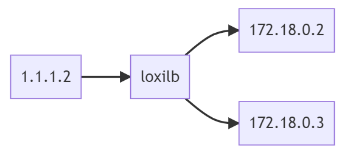

## Check Topology
---




Check researchable like this:

```
ip netns exec loxilb ping 1.1.1.2
ip netns exec loxilb ping 172.18.0.2
ip netns exec loxilb ping 172.18.0.3
```

Need to cnofigure kubernetes node to know about client routing domain(1.1.1.0/24). For this add static routing as like following :

```
docker exec -it k8s-playground-control-plane ip route add 1.1.1.0/24 via 172.18.0.254 dev eth0
docker exec -it k8s-playground-control-plane ip route add 1.1.1.0/24 via 172.18.0.254 dev eth0
```

If want to exchange routing informations dynamically between client and k8s domain, you can use BGP. Our LoxiLB already integrated with goBGP. reference this [blog](https://www.loxilb.io/post/running-calico-cni-in-bgp-mode-with-loxilb) for this.