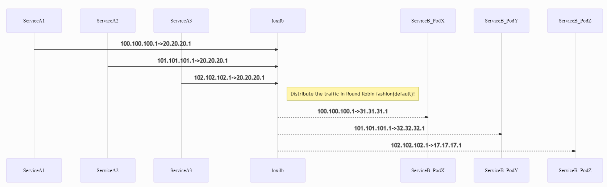

Install WSK HTTP Traffic generator benchmark tool:
```
sudo apt-get install build-essential libssl-dev git -y 
git clone https://github.com/wg/wrk.git wrk 
cd wrk 
sudo make 
sudo cp wrk /usr/local/bin 
```

Install sample http server:
```
cd ~/
go build server.go
```

Run HTTP Server one endpoint1 following:
```
sudo ip netns exec l3e1 bash
./server
```

Run HTTP Server one endpoint2 following:

Open New Terminal
```
sudo ip netns exec l3e2 bash
./server
```

Run HTTP Server one endpoint3 following:

Open New Terminal
```
sudo ip netns exec l3e3 bash
./server
```

Run HTTP traffic generator on client following:

Open New Terminal
```
sudo ip netns exec l3c1 bash
wrk -t8 -c400 -d30s http://20.20.20.1:2020/
Running 30s test @ http://20.20.20.1:2020/
  8 threads and 400 connections
  Thread Stats   Avg      Stdev     Max   +/- Stdev
    Latency    11.93ms   13.66ms 164.26ms   86.43%
    Req/Sec     5.82k     0.99k   14.19k    70.55%
  1391123 requests in 30.09s, 99.50MB read
Requests/sec:  46232.45
Transfer/sec:  3.31MB
```

The topology for this test is similar to the above case. However, all the services run in one system and loxilb run in separate dedicated system. All other configurations remain the same.

And Traffic flow as like this diagram:


