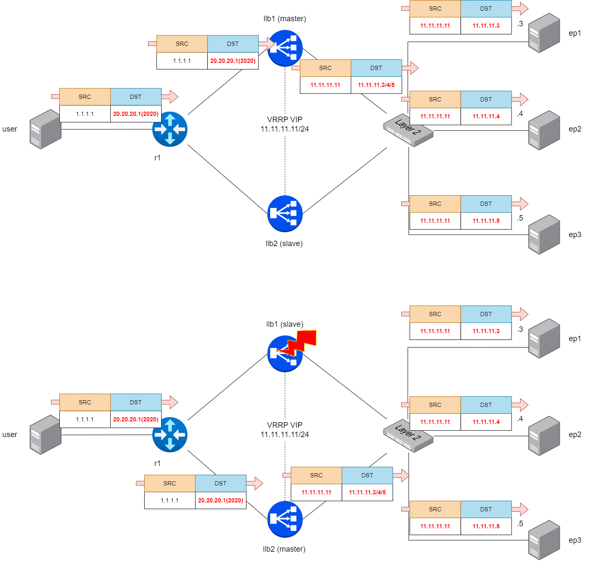
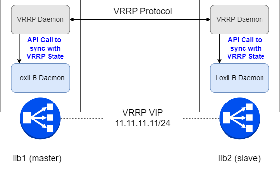

#  Achieving LoxiLB Load Balancing Test with HA mode

Welcome to the tutorial where you learn how to configure LoxiLB.

On a serious note, we will look into how to use LoxiLB for TCP test with HA mode. 

In HA mode implementation of the LoxiLB operation, we used VRRP(Virtual Router Redundancy Protocol) protocol between LoxiLB nodes. 

The Virtual Router Redundancy Protocol (VRRP) eliminates the single point of failure inherent in the static default routed environment. VRRP specifies an election protocol that dynamically assigns responsibility for a load balancer to one of the VPN Concentrators on a LAN. The VRRP VPN Concentrator that controls the IP address(es) associated with a load balancer is called the Primary, and forwards packets sent to those IP addresses. When the Primary becomes unavailable, a backup VPN Concentrator takes the place of the Primary.

LoxiLB completely sync with VRRP using LoxiLB API. Following diagram describe this.

LoxiLB was built with this in mind and it in this tutorial you will learn:

* How to configure **LoxiLB**
* How to do a troubleshoot.
* How to test performance.

### Feedback

Do you see any bug, typo in the tutorial or you have some feedback for us?
Let us know on https://github.com/loxilb-io/loxilb or #loxilb slack channel linked on https://loxilb.io

### Contributed by:
contact@netlox.io

