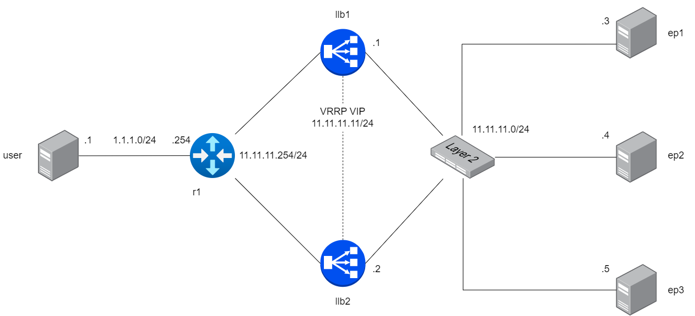

LoxiLB has been installed like described [here](https://loxilb-io.github.io/loxilbdocs/run/)

View the installed LoxiLB:
```
docker exec -it llb1 loxicmd help
```

## Check Topology
---



Make sure to enable topolgoy configuration like this:

```
ip netns exec ep1 ifconfig eth0
ip netns exec ep2 ifconfig eth0
ip netns exec ep3 ifconfig eth0
ip netns exec r1 route -n
ip netns exec llb1 route -n
ip netns exec llb2 route -n
ip netns exec user ifconfig eth0
```

Check researchable like this:

```
ip netns exec llb1 ping 11.11.11.3 -c 5
ip netns exec llb1 ping 11.11.11.4 -c 5
ip netns exec llb1 ping 11.11.11.5 -c 5
ip netns exec llb2 ping 11.11.11.3 -c 5
ip netns exec llb2 ping 11.11.11.4 -c 5
ip netns exec llb2 ping 11.11.11.5 -c 5
ip netns exec r1 ping 1.1.1.1 -c 5
ip netns exec r1 ping 11.11.11.1 -c 5
ip netns exec r1 ping 11.11.11.2 -c 5
```
