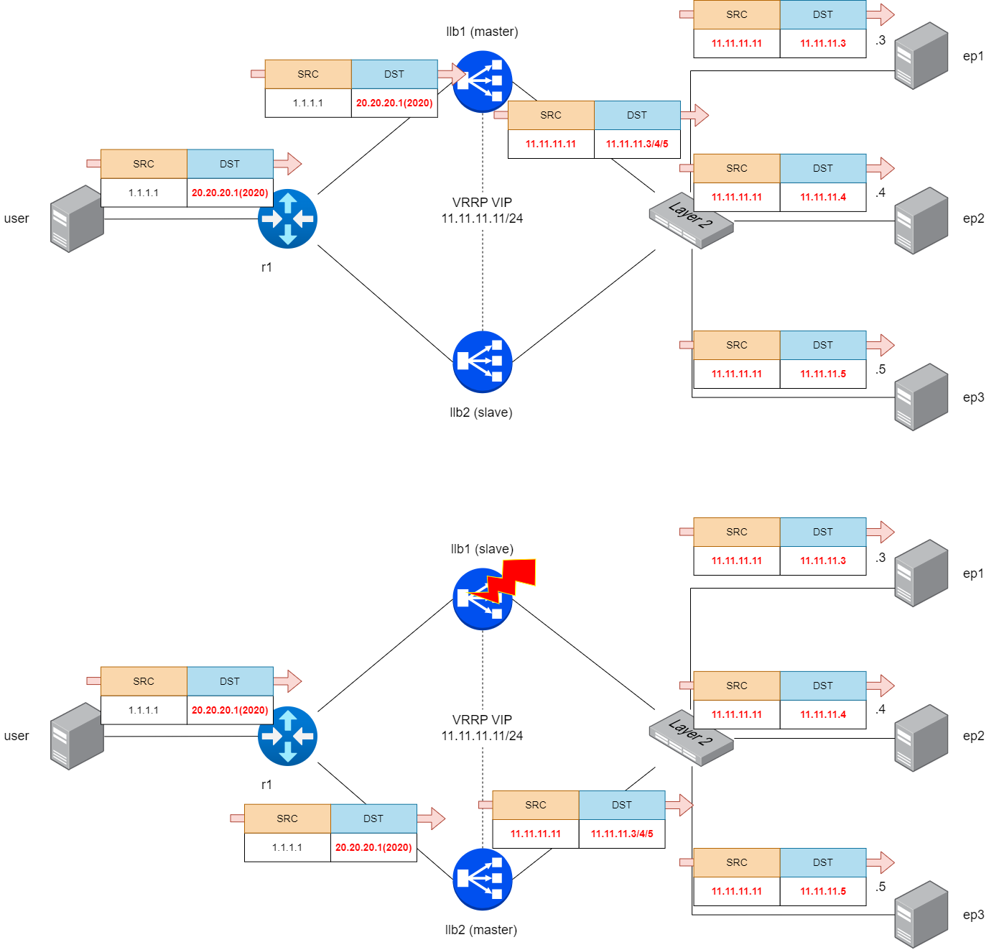

Configure LoxiLB

```
cd ~/
sudo /bin/bash ./config.sh
```

Summary `config.sh` file :
```
docker exec -it llb1 bash
root@8b74b5ddc4d2:/# loxicmd create lb 20.20.20.1 --tcp=2020:8080 --endpoints=11.11.11.3:1,11.11.11.4:1,11.11.11.5:1 --mode=fullnat
root@8b74b5ddc4d2:/# exit

docker exec -it llb2 bash
root@8b74b5ddc4d3:/# loxicmd create lb 20.20.20.1 --tcp=2020:8080 --endpoints=11.11.11.3:1,11.11.11.4:1,11.11.11.5:1 --mode=fullnat
root@8b74b5ddc4d3:/# exit

```

This command will configure LB policy to connection TCP client with `20.20.20.1` VIP and `11.11.11.3, 11.11.11.4, 11.11.11.3,` IPv4 endpoints with Full-NAT Mode per each LoxiLB nodes.

LoxiLB'S TCP Full-NAT HA mode is operationg as like following diagram:



configuration

Check LoxiLB TCP Full-NAT mode with HA configuration :
```
docker exec -it llb1 bash
root@0cb735c42e72:/# loxicmd get lb -o wide
| EXTERNAL IP | PORT | PROTOCOL | BLOCK | SELECT |  MODE   | ENDPOINT IP | TARGET PORT | WEIGHT | STATE  |
|-------------|------|----------|-------|--------|---------|-------------|-------------|--------|--------|
| 2001::1     | 2020 | tcp      |     0 | rr     | default | 31.31.31.1  |        8080 |      1 | active |
|             |      |          |       |        |         | 32.32.32.1  |        8080 |      1 | active |
|             |      |          |       |        |         | 33.33.33.1  |        8080 |      1 | active |
```

