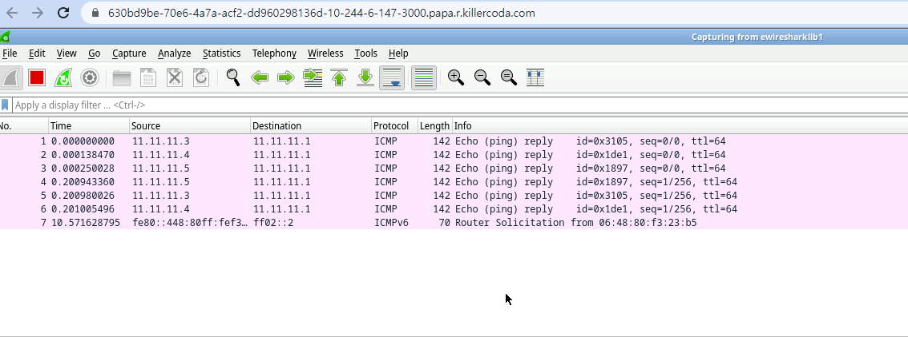

Validate LoxiLB HA LB Feature

```
cd ~/
sudo /bin/bash ./validation.sh
HA-1
HA-1 HA state llb1-MASTER llb2-BACKUP
Master:llb1 Backup:llb2
server1 UP
server2 UP
server3 UP
server1
server2
server3
server1
server2
server3
server1
server2
server3
server1
server2
server3
HA-1 Phase-1 [OK]
ka_llb1
HA-1 HA state llb1-BACKUP llb2-MASTER
HA-1 HA [SUCCESS]
server1 UP
server2 UP
server3 UP
server1
server2
server3
server1
server2
server3
server1
server2
server3
server1
server2
server3
HA-1 [OK]
```

(0) Create Mirror Linkbw LoxiLB and Wireshark node
```
source ./common.sh
connect_docker_hosts_default_ns llb1 wireshark
```

(1) Create Mirror Object for analytics

LoxiLB can support mirror for analytics. 

Mirroring Configuration sending from `ellb1r1`(link bw llb1 <--> switch) to `ellb1wireshark`(llb1 <--> link bw wireshark node )

```
./config-mirror.sh 1 ellb1r1 ellb1wireshark
```

`1` is unique id for mirror object.

Access Wireshark for Analytics [ACCESS WIRESHARK]({{TRAFFIC_HOST1_3000}}) and select `ewiresharkllb1` as capturing port.

You can check as like following figure:



(2) Delete Mirror Object

```
./rmconfig-mirror.sh 1 
```

`1` is unique id which is created before.