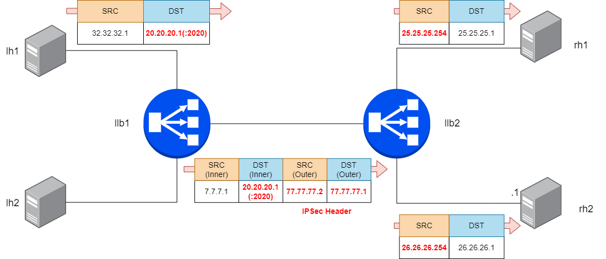

#  Achieving LoxiLB TCP Load Balancing Test with IPSec and Strongswan

Welcome to the tutorial where you learn how to configure LoxiLB.

On a serious note, we will look into how to use LoxiLB for TCP test with IPSec and Strongswan. 

The IPSEC protocol (Internet Protocol Security) enables you to load balance between gateways.Following figure shows inbound IPSEC traffic being load balanced to one of two destination VPN gateways.

The strongSwan is a comprehensive implementation of the Internet Key Exchange (IKE) protocols that allows securing IP traffic in policy- and route-based IPsec scenarios from simple to very complex. With strongswan and LoxiLB, we will test policy based IPSec scenario

LoxiLB was built with this in mind and it in this tutorial you will learn:

* How to configure **LoxiLB**: How to setup it and How to use loxi CLI.
* How to do a troubleshoot.
* How to test performance.

### Feedback

Do you see any bug, typo in the tutorial or you have some feedback for us?
Let us know on https://github.com/loxilb-io/loxilb or #loxilb slack channel linked on https://loxilb.io

### Contributed by:
contact@netlox.io

