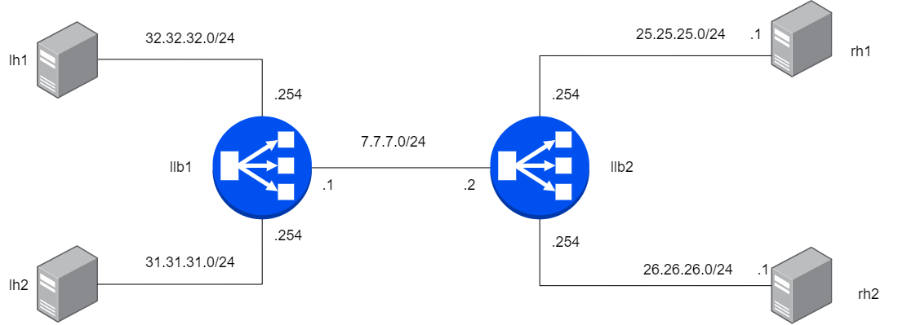

LoxiLB has been installed like described [here](https://loxilb-io.github.io/loxilbdocs/run/)

View the installed LoxiLB:
```
docker exec -it llb1 loxicmd help
```

## Check Topology
---



Make sure to enable topolgoy configuration like this:

```
ip netns exec lh1 ifconfig eth0
ip netns exec lh2 ifconfig eth0
ip netns exec rh1 ifconfig eth0
ip netns exec rh2 ifconfig eth0
ip netns exec llb1 route -n
ip netns exec llb2 route -n
```

Check researchable like this:

```
ip netns exec llb1 ping 32.32.32.1
ip netns exec llb1 ping 31.31.31.1
ip netns exec llb1 ping 7.7.7.2
ip netns exec llb2 ping 25.25.25.1
ip netns exec llb2 ping 26.26.26.1
```
