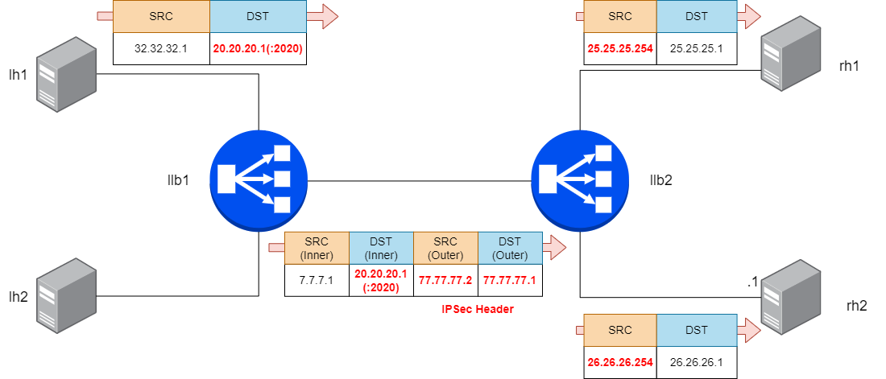

Configure LoxiLB

```
cd ~/
sudo /bin/bash ./config.sh
```

Summary `config.sh` file :
```
docker exec -it llb2 bash
root@8b74b5ddc4d2:/# loxicmd create lb 20.20.20.1 --tcp=2020:8080 --endpoints=25.25.25.1:1,26.26.26.1:1
```

This command will configure LB policy to connection TCP client with `20.20.20.1` VIP and `25.25.25.1, 26.26.26.1` IPv4 TCP endpoints over IPSec tunnel.

LoxiLB'S LB over IPSec mode is operationg as like following diagram:



configuration

Check LoxiLB IPSec mode configuration :
```
root@452ff4ccfb44:/# loxicmd get lb -o wide
| EXTERNAL IP | PORT | PROTOCOL | BLOCK | SELECT |  MODE   | ENDPOINT IP | TARGET PORT | WEIGHT | STATE  |
|-------------|------|----------|-------|--------|---------|-------------|-------------|--------|--------|
| 20.20.20.1  | 2020 | tcp      |     0 | rr     | default | 25.25.25.1  |        8080 |      1 | active |
|             |      |          |       |        |         | 26.26.26.1  |        8080 |      1 | active |
root@452ff4ccfb44:/# loxicmd get port -o wide | grep vti
|     1 | ip_vti0   | 00:00:00:00:00:00 | false/false |     0 | true/true    | rx/tx byte : 0/0      | Routed: false                  | IsPVID: true  |    0 |
|       |           |                   |             |       | vti          | rx/tx packets : 0/0   | IPv4 : []                      | VID : 4021    |      |
|     2 | vti100    | 07:07:07:02:08:00 | true/true   |  8980 | true/true    | rx/tx byte : 0/0      | Routed: true IPv4 :            | IsPVID: true  |    0 |
|       |           |                   |             |       | vti          | rx/tx packets : 0/0   | [77.77.77.1/32 - Primary]      | VID : 4022    |      |
root@452ff4ccfb44:/# 
```

