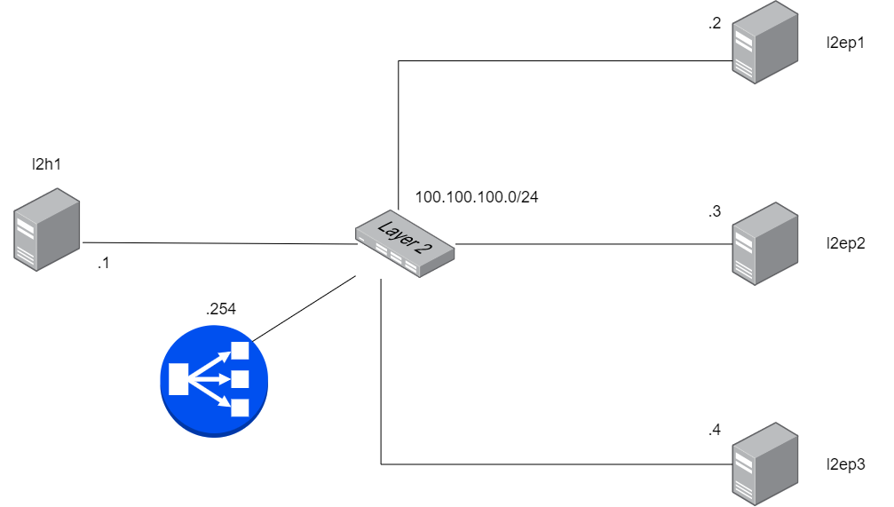

LoxiLB has been installed like described [here](https://loxilb-io.github.io/loxilbdocs/run/)

View the installed LoxiLB:
```
docker exec -it llb1 loxicmd help
```

## Check Topology
---



Make sure to enable topolgoy configuration like this:

```
ip netns exec l2ep1 ifconfig eth0
ip netns exec l2ep2 ifconfig eth0
ip netns exec l2ep3 ifconfig eth0
ip netns exec l2h1 ifconfig eth0
ip netns exec llb1 route -n
```

Check researchable like this:

```
ip netns exec l2h1 ping 100.100.100.2
ip netns exec l2h1 ping 100.100.100.3
ip netns exec l2h1 ping 100.100.100.4
```
