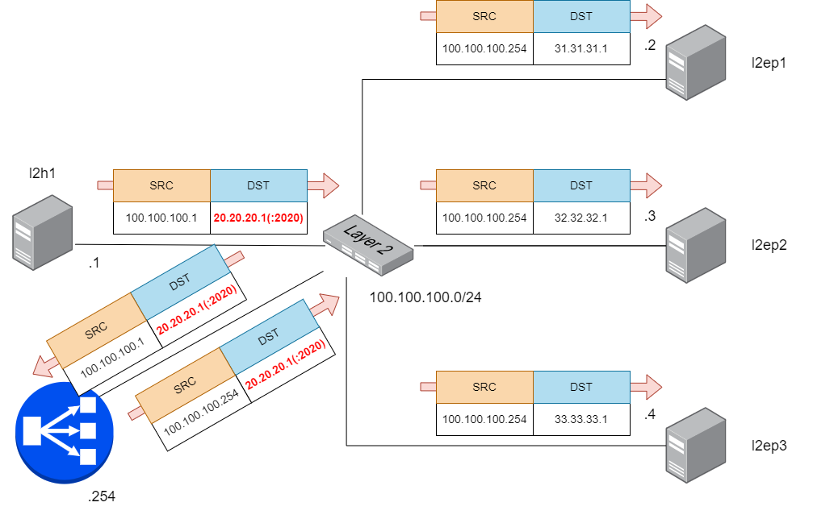

Configure LoxiLB

```
cd ~/
sudo /bin/bash ./config.sh
```

Need more time for lb end-point health check (Take almost 40 seconds)

Summary `config.sh` file :
```
docker exec -it llb1 bash
root@8b74b5ddc4d2:/# llb1 loxicmd create lb 20.20.20.1 --tcp=2020:8080 --endpoints=100.100.100.2:1,100.100.100.3:1,100.100.100.4:1 --mode=onearm
```

This command will configure LB policy with basic TCP LB rule. 

LoxiLB'S One-ARM mode is operating as like following diagram:




Check LoxiLB One-ARM mode configuration :
```
root@10571b8b644a:/# loxicmd get lb -o wide
| EXTERNAL IP | PORT | PROTOCOL | BLOCK | SELECT |  MODE  |  ENDPOINT IP  | TARGET PORT | WEIGHT | STATE  |
|-------------|------|----------|-------|--------|--------|---------------|-------------|--------|--------|
| 20.20.20.1  | 2020 | tcp      |     0 | rr     | onearm | 100.100.100.2 |        8080 |      1 | active |
|             |      |          |       |        |        | 100.100.100.3 |        8080 |      1 | active |
|             |      |          |       |        |        | 100.100.100.4 |        8080 |      1 | active |
```


