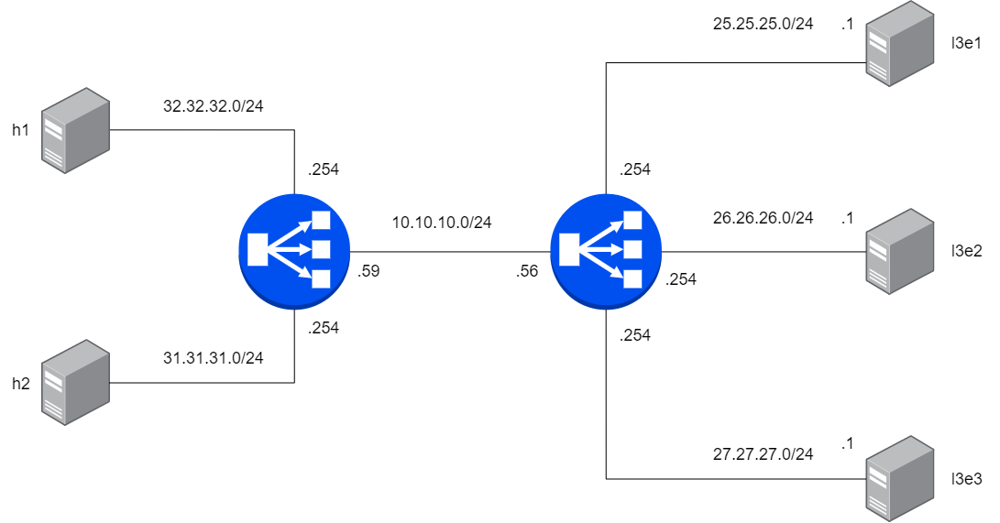

LoxiLB has been installed like described [here](https://loxilb-io.github.io/loxilbdocs/run/)

View the installed LoxiLB:
```
docker exec -it llb1 loxicmd help
```

## Check Topology
---



Make sure to enable topolgoy configuration like this:

```
ip netns exec l3e1 ifconfig eth0
ip netns exec l3e2 ifconfig eth0
ip netns exec l3e3 ifconfig eth0
ip netns exec h1 ifconfig eth0
ip netns exec h2 ifconfig eth0
ip netns exec llb1 route -n
ip netns exec llb2 route -n
```

Check researchable like this:

```
ip netns exec llb1 ping 32.32.32.1
ip netns exec llb1 ping 31.31.31.1
ip netns exec llb1 ping 10.10.10.56
ip netns exec llb2 ping 25.25.25.1
ip netns exec llb2 ping 26.26.26.1
ip netns exec llb2 ping 27.27.27.1
```
