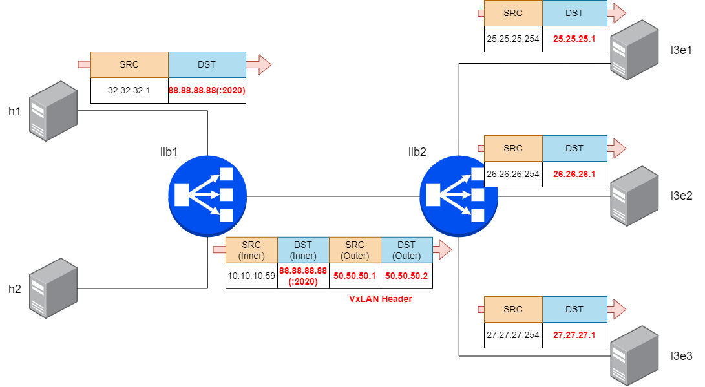

Configure LoxiLB

```
cd ~/
sudo /bin/bash ./config.sh
```

Summary `config.sh` file :
```
docker exec -it llb2 bash
root@8b74b5ddc4d2:/# loxicmd create lb 88.88.88.88 --sctp=2020:8080 --endpoints=25.25.25.1:1,26.26.26.1:1,27.27.27.1:1
```

This command will configure LB policy to connection SCTP client with `88.88.88.88` VIP and `25.25.25.1, 26.26.26.1, 27.27.27.1` IPv4 STCP endpoints with VxLAN Overlay

LoxiLB'S SCTP VxLAN Overlay is operating as like following diagram:




Check LoxiLB SCTP VxLAN Overlay configuration :
```
root@21a6f55a0509:/#  loxicmd get lb -o wide
| EXTERNAL IP | PORT | PROTOCOL | BLOCK | SELECT |  MODE   | ENDPOINT IP | TARGET PORT | WEIGHT | STATE  |
|-------------|------|----------|-------|--------|---------|-------------|-------------|--------|--------|
| 88.88.88.88 | 2020 | sctp     |     0 | rr     | default | 25.25.25.1  |        8080 |      1 | active |
|             |      |          |       |        |         | 26.26.26.1  |        8080 |      1 | active |
|             |      |          |       |        |         | 27.27.27.1  |        8080 |      1 | active |
root@21a6f55a0509:/# loxicmd get port | grep vxlan
|     9 | vxlan50   | fa:00:a3:6f:59:13 | true/true  | Routed: true IPv4 :            | IsPVID: true  |
```


