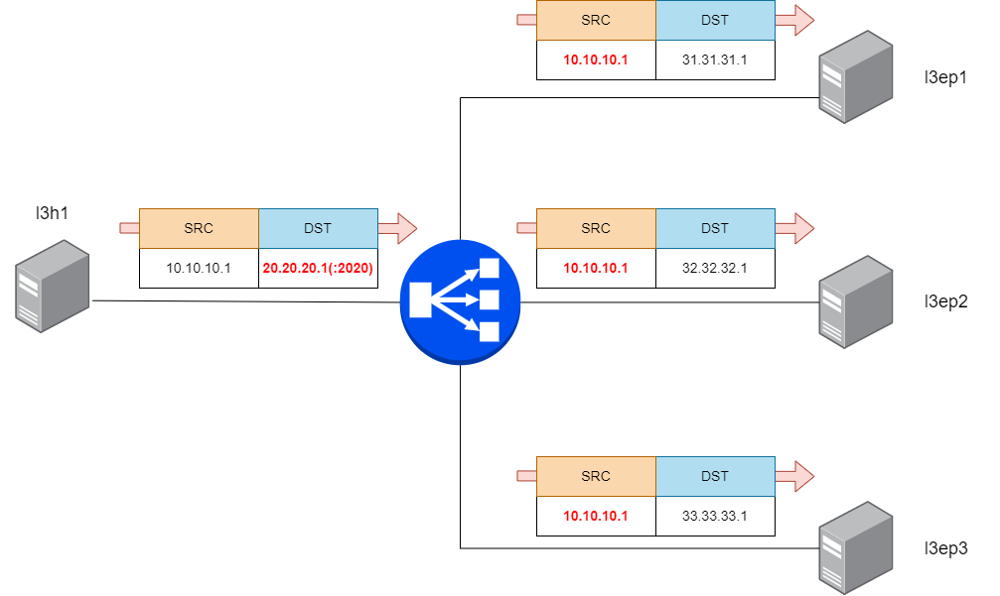

Configure LoxiLB

```
cd ~/
sudo /bin/bash ./config.sh
```

Summary `config.sh` file :
```
docker exec -it llb1 bash
root@8b74b5ddc4d2:/# llb1 loxicmd create lb 20.20.20.1 --tcp=2020:2020 --endpoints=31.31.31.1:1,32.32.32.1:1,33.33.33.1:1 --mode=dsr
```

This command will configure LB policy with basic TCP LB DSR Mode rule. 

This command will configure LB policy with `--mode=dsr`. You can define DSR mode with `--mode=dsr` value.

LoxiLB'S DSR is operating as like following diagram:




Check LoxiLB DSR configuration :
```
root@0cb735c42e72:/# loxicmd get lb -o wide
| EXTERNAL IP | PORT | PROTOCOL | BLOCK | SELECT | MODE | ENDPOINT IP | TARGET PORT | WEIGHT | STATE  |
|-------------|------|----------|-------|--------|------|-------------|-------------|--------|--------|
| 20.20.20.1  | 2020 | tcp      |     0 | rr     | dsr  | 31.31.31.1  |        2020 |      1 | active |
|             |      |          |       |        |      | 32.32.32.1  |        2020 |      1 | active |
|             |      |          |       |        |      | 33.33.33.1  |        2020 |      1 | active |
```


