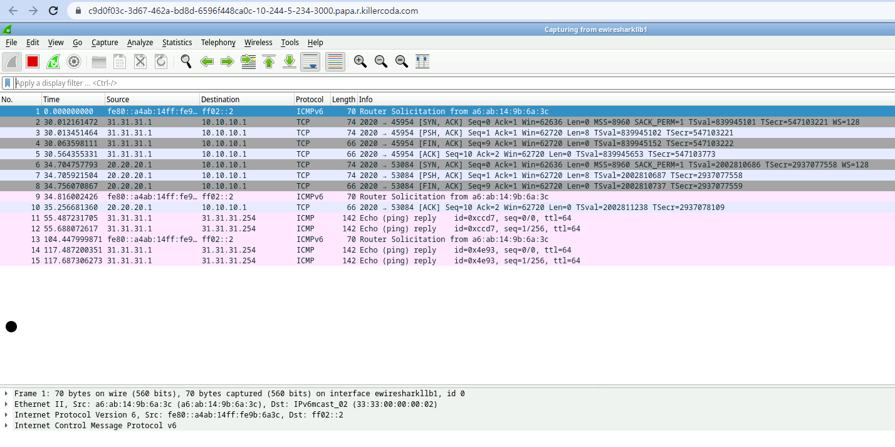

Validate LoxiLB DSR Feature

```
cd ~/
sudo /bin/bash ./validation.sh
SCENARIO-tcplbdsr
server1 UP
server2 UP
server3 UP
server1
server2
server3
SCENARIO-tcplbdsr [OK]
./validation.sh: line 51: 24452 Killed                  $hexec l3ep1 socat -v -T0.05 tcp-l:2020,reuseaddr,fork system:"echo 'server1'; cat" > /dev/null 2>&1
./validation.sh: line 51: 24453 Killed                  $hexec l3ep2 socat -v -T0.05 tcp-l:2020,reuseaddr,fork system:"echo 'server2'; cat" > /dev/null 2>&1
./validation.sh: line 51: 24454 Killed                  $hexec l3ep3 socat -v -T0.05 tcp-l:2020,reuseaddr,fork system:"echo 'server3'; cat" > /dev/null 2>&1
```

Summary `validation.sh` file :

In initial time, it will make http(8080 port) sessions with servers(31.31.31.1, 32.32.32.1, 33.33.33.1).

You need to check on dendpoints(31.31.31.1 - 3) that traffic is comming with original client IP(`10.10.10.1`). In DSR mode, traffic has to come without LB Source IP.

(0) Create Mirror Linkbw LoxiLB and Wireshark node
```
source ./common.sh
connect_docker_hosts_default_ns llb1 wireshark
```

(1) Create Mirror Object for analytics

LoxiLB can support mirror for analytics. 

Mirroring Configuration sending from `ellb1l3ep1`(link bw llb1 <--> l3ep1) to `ellb1wireshark`(llb1 <--> link bw wireshark node )

```
./config-mirror.sh 1 ellb1l3ep1 ellb1wireshark
```

`1` is unique id for mirror object.

Access Wireshark for Analytics [ACCESS WIRESHARK]({{TRAFFIC_HOST1_3000}}) and select `ewiresharkllb1` as capturing port.

You can check as like following figure:



(2) Delete Mirror Object

```
./rmconfig-mirror.sh 1 
```

`1` is unique id which is created before.