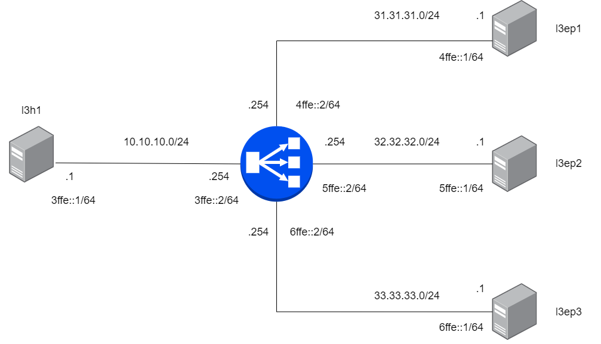

LoxiLB has been installed like described [here](https://loxilb-io.github.io/loxilbdocs/run/)

View the installed LoxiLB:
```
docker exec -it llb1 loxicmd help
```

## Check Topology
---



Make sure to enable topolgoy configuration like this:

```
ip netns exec l3ep1 ifconfig eth0
ip netns exec l3ep2 ifconfig eth0
ip netns exec l3ep3 ifconfig eth0
ip netns exec l3h1 ifconfig eth0
ip netns exec llb1 route -n
```

Check researchable like this:

```
ip netns exec llb1 ping 31.31.31.1 
ip netns exec llb1 ping 32.32.32.1 
ip netns exec llb1 ping 33.33.33.1 
ip netns exec llb1 ping 10.10.10.1 
```
