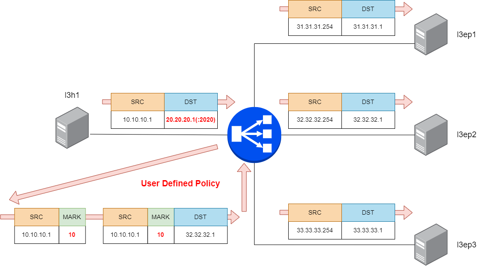

Configure LoxiLB

```
cd ~/
sudo /bin/bash ./config.sh
```

Summary `config.sh` file :
```
docker exec -it llb1 bash
root@8b74b5ddc4d2:/# llb1 loxicmd create lb 20.20.20.1 --tcp=2020:8080 --endpoints=31.31.31.1:1,32.32.32.1:1,33.33.33.1:1 --mark=10
root@8b74b5ddc4d2:/# llb1 loxicmd create firewall --firewallRule="sourceIP:10.10.10.1/32,preference:200" --allow --setmark=10
```

This command will configure LB policy with specific internal mark feild. `--mark=10` defines some internal markfield value. And you can add some mark feind on firewall table stage with `--setmark` action.

In validation step, you will dynamically update mark policy and check operation.

LoxiLB'S MARK is operationg as like following diagram:



Check LoxiLB MARK configuration :
```
root@b87ed65dd4d2:/# loxicmd get lb -o wide
| EXTERNAL IP | PORT | PROTOCOL | BLOCK | SELECT |  MODE   | ENDPOINT IP | TARGET PORT | WEIGHT | STATE  |
|-------------|------|----------|-------|--------|---------|-------------|-------------|--------|--------|
| 20.20.20.1  | 2020 | tcp      |    10 | rr     | default | 31.31.31.1  |        8080 |      1 | active |
|             |      |          |       |        |         | 32.32.32.1  |        8080 |      1 | active |
|             |      |          |       |        |         | 33.33.33.1  |        8080 |      1 | active |
root@b87ed65dd4d2:/# loxicmd get fw -o wide
|   SOURCE IP   | DESTINATION IP | MIN SPORT | MAX SPORT | MIN DPORT | MAX DPORT | PROTOCOL | PORT NAME | PREFERENCE |      OPTION      |
|---------------|----------------|-----------|-----------|-----------|-----------|----------|-----------|------------|------------------|
| 10.10.10.1/32 | 0.0.0.0/0      |         0 |         0 |         0 |         0 |        0 |           |        200 | Allow,FwMark(10) |
root@b87ed65dd4d2:/# 
```

**BLOCK** means MARK field value


