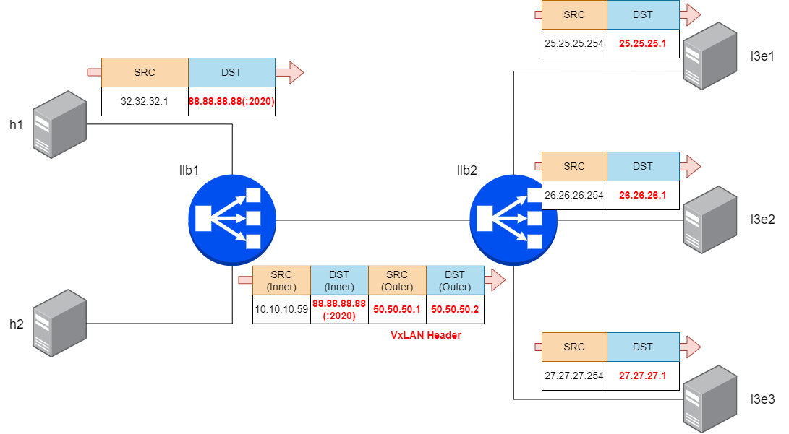

#  Achieving LoxiLB TCP Load Balancing Test with VxLAN Overlay

Welcome to the tutorial where you learn how to configure LoxiLB.

On a serious note, we will look into how to use LoxiLB for TCP test with VxLAN Overlay. 

VXLAN is an encapsulation protocol that provides data center connectivity using tunneling to stretch Layer 2 connections over an underlying Layer 3 network. The VXLAN tunneling protocol that encapsulates Layer 2 Ethernet frames in Layer 3 UDP packets, enables you to create virtualized Layer 2 subnets, or segments, that span physical Layer 3 networks. Each Layer 2 subnet is uniquely identified by a VXLAN network identifier (VNI) that segments traffic.

LoxiLB was built with this in mind and it in this tutorial you will learn:

* How to configure **LoxiLB**: How to setup it and How to use loxi CLI.
* How to do a troubleshoot.
* How to test performance.

### Feedback

Do you see any bug, typo in the tutorial or you have some feedback for us?
Let us know on https://github.com/loxilb-io/loxilb or #loxilb slack channel linked on https://loxilb.io

### Contributed by:
contact@netlox.io

