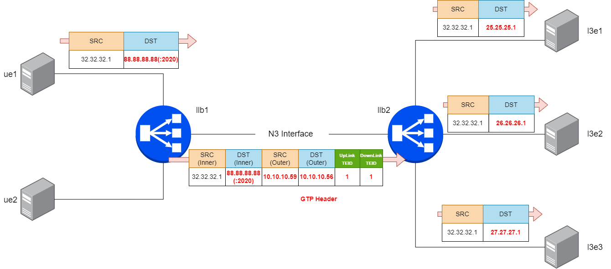

Configure LoxiLB

```
cd ~/
sudo /bin/bash ./config.sh
```

Summary `config.sh` file :

(1) llb1 configuration to allow UE1(32.32.32.1) GTP traffic bypass
```
docker exec -it llb1 bash
root@8b74b5ddc4d2:/# loxicmd create session user1 88.88.88.88 --accessNetworkTunnel 1:10.10.10.56 --coreNetworkTunnel=1:10.10.10.59
root@8b74b5ddc4d2:/# loxicmd create sessionulcl user1 --ulclArgs=11:32.32.32.1
```

(2) llb1 configuration to allow UE2(31.31.31.1) GTP traffic bypass
```
docker exec -it llb1 bash
root@8b74b5ddc4d2:/# loxicmd create session user2 88.88.88.88 --accessNetworkTunnel 2:10.10.10.56 --coreNetworkTunnel=2:10.10.10.59
root@8b74b5ddc4d2:/# loxicmd create sessionulcl user2 --ulclArgs=12:31.31.31.1
```

(3) llb2 configurateion to match UE1(32.32.32.1) and apply LBO 
```
docker exec -it llb2 bash
root@8b74b5ddc4d3:/# loxicmd create session user1 32.32.32.1 --accessNetworkTunnel 1:10.10.10.59 --coreNetworkTunnel=1:10.10.10.56
root@8b74b5ddc4d3:/# loxicmd create sessionulcl user1 --ulclArgs=11:88.88.88.88
```

(4) llb2 configurateion to match UE2(31.31.31.1) and apply LBO 
```
docker exec -it llb2 bash
root@8b74b5ddc4d3:/# loxicmd create session user2 31.31.31.1 --accessNetworkTunnel 2:10.10.10.59 --coreNetworkTunnel=2:10.10.10.56
root@8b74b5ddc4d3:/# loxicmd create sessionulcl user2 --ulclArgs=12:88.88.88.88
```

(5) llb2 configuration to apply Load Balancing Rule
```
docker exec -it llb2 bash
root@8b74b5ddc4d3:/# llb2 loxicmd create lb 88.88.88.88 --sctp=2020:8080 --endpoints=25.25.25.1:1,26.26.26.1:1,27.27.27.1:1
```

This command will configure LB policy to connection TCP client with `88.88.88.88` VIP and `25.25.25.1, 26.26.26.1, 27.27.27.1` IPv4 TCP endpoints

LoxiLB'S 5G N3 Interface LBO is operating as like following diagram:



Check LoxiLB 5G N3 Interface LBO configuration :
```
docker exec -it llb2 bash
root@b4649811d39c:/# loxicmd get lb -o wide
| EXTERNAL IP | PORT | PROTOCOL | BLOCK | SELECT |  MODE   | ENDPOINT IP | TARGET PORT | WEIGHT | STATE  |
|-------------|------|----------|-------|--------|---------|-------------|-------------|--------|--------|
| 88.88.88.88 | 2020 | sctp     |     0 | rr     | default | 25.25.25.1  |        8080 |      1 | active |
|             |      |          |       |        |         | 26.26.26.1  |        8080 |      1 | active |
|             |      |          |       |        |         | 27.27.27.1  |        8080 |      1 | active |
root@b4649811d39c:/# loxicmd get session -o wide
| IDENT | SESSION IP |     ACCESS NETWORK TUNNEL     |      CORE NETWORK TUNNEL      |
|-------|------------|-------------------------------|-------------------------------|
| user1 | 32.32.32.1 | TeID: 1 TunnelIP: 10.10.10.59 | TeID: 1 TunnelIP: 10.10.10.56 |
| user2 | 31.31.31.1 | TeID: 2 TunnelIP: 10.10.10.59 | TeID: 2 TunnelIP: 10.10.10.56 |
root@b4649811d39c:/# loxicmd get sessionulcl -o wide
| IDENT |   ULCL IP   | QFI |
|-------|-------------|-----|
| user1 | 88.88.88.88 |  11 |
| user2 | 88.88.88.88 |  12 |
root@b4649811d39c:/# 
```

