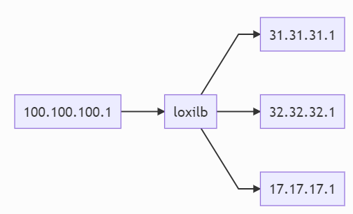

LoxiLB has been installed like described [here](https://loxilb-io.github.io/loxilbdocs/run/)

View the installed LoxiLB:
```
docker exec -it loxilb loxicmd help
```

## Check Topology
---



Make sure to enable topolgoy configuration like this:

```
ip netns exec l3e1 ip -a
ip netns exec l3e2 ip -a
ip netns exec l3e3 ip -a
ip netns exec h1 ip -a
ip netns exec h2 ip -a
ip netns exec llb1 route -n
ip netns exec llb2 route -n
```

Check researchable like this:

```
ip netns exec llb1 ping 31.31.31.1 
ip netns exec llb1 ping 32.32.32.1 
ip netns exec llb1 ping 17.17.17.1 
ip netns exec llb1 ping 100.100.100.1 
```
