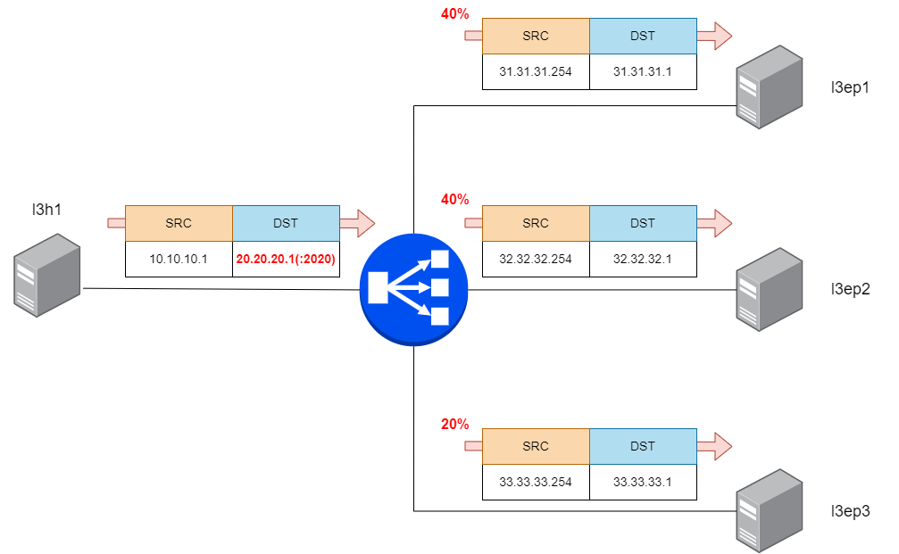

Configure LoxiLB

```
cd ~/
sudo /bin/bash ./config.sh
```

Summary `config.sh` file :
```
docker exec -it llb1 bash
root@8b74b5ddc4d2:/# loxicmd create lb 20.20.20.1 --select=priority --tcp=2020:8080 --endpoints=31.31.31.1:40,32.32.32.1:40,33.33.33.1:20
```

This command will configure LB policy with WRR algorithm. `--endpoints=31.31.31.1:40,32.32.32.1:40,33.33.33.1:20` defines endpoint's WRR value(40 / 40 / 20). LoxiLB will distribute flow table resources according to these WRR values.

LoxiLB'S WRR is operating as like following diagram:




Check LoxiLB WRR configuration :
```
root@0cb735c42e72:/# loxicmd get lb -o wide
| EXTERNAL IP | PORT | PROTOCOL | BLOCK | SELECT |  MODE   | ENDPOINT IP | TARGET PORT | WEIGHT | STATE  |
|-------------|------|----------|-------|--------|---------|-------------|-------------|--------|--------|
| 20.20.20.1     | 2020 | tcp      |     0 | rr     | default | 31.31.31.1  |        8080 |      40 | active |
|             |      |          |       |        |         | 32.32.32.1  |        8080 |      40 | active |
|             |      |          |       |        |         | 33.33.33.1  |        8080 |      40 | active |
```

